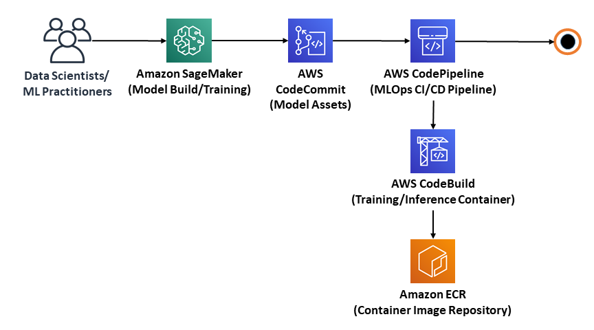
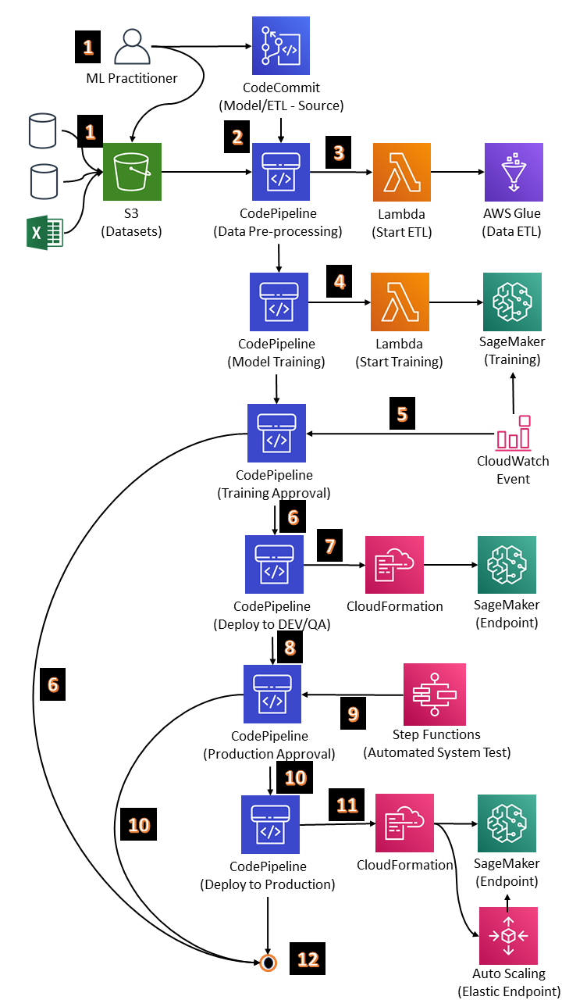
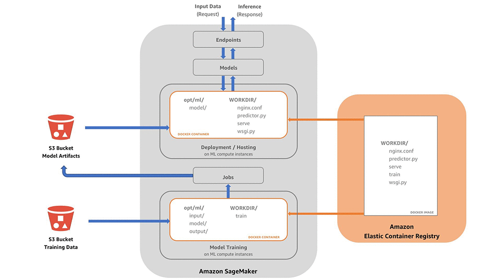
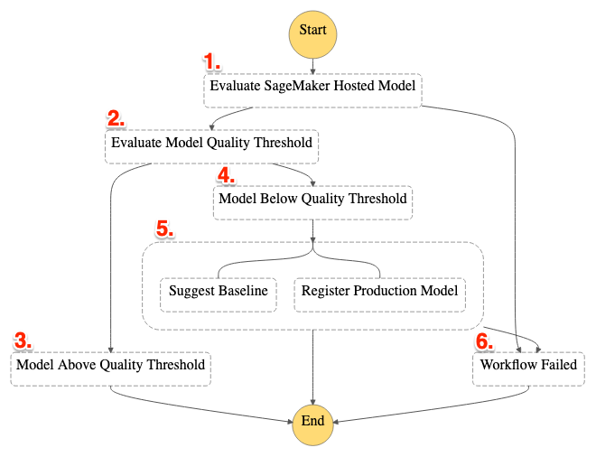
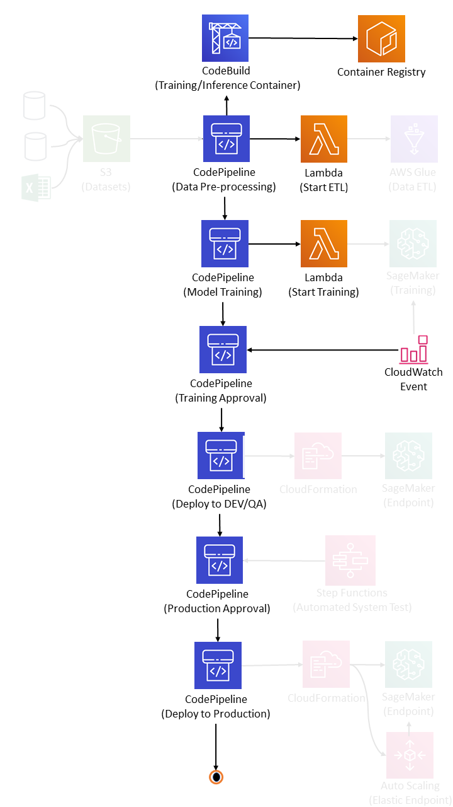

# Use case


# Architecture 



# Setting Up the AWS Account & Cloud9 for CLI
```
aws sts get-caller-identity
sudo yum -y install jq bash-completion
```
# Variables for Hands On
```
export AWS_DEFAULT_REGION=$(curl -s 169.254.169.254/latest/dynamic/instance-identity/document | jq -r .region)
aws configure set default.region ${AWS_DEFAULT_REGION}
export AWS_ACCOUNT_ID=$(aws sts get-caller-identity --query "Account" --output text)
export VERIFY_ROLE_ARN="arn\:aws\:iam::${AWS_ACCOUNT_ID}\:role/MLOps"
export DATA_BUCKET="data-${AWS_DEFAULT_REGION}-${AWS_ACCOUNT_ID}"
export PIPELINE_BUCKET="mlops-${AWS_DEFAULT_REGION}-${AWS_ACCOUNT_ID}"
echo "export AWS_ACCOUNT_ID=$AWS_ACCOUNT_ID" >> ~/.bashrc
echo "export VERIFY_ROLE_ARN=$VERIFY_ROLE_ARN" >> ~/.bashrc
echo "export AWS_DEFAULT_REGION=$AWS_DEFAULT_REGION" >> ~/.bashrc
echo "export DATA_BUCKET=$DATA_BUCKET" >> ~/.bashrc
echo "export PIPELINE_BUCKET=$PIPELINE_BUCKET" >> ~/.bashrc


```
# Default Setting
- Region : us-west-2

# Setting Up the cli in cloud9
```
curl -O https://bootstrap.pypa.io/get-pip.py &&\
sudo python3 get-pip.py --user --no-warn-script-location &&\
rm get-pip.py &&\
python3 -m pip install -U pip boto3 numpy pandas wget awscli --user
```

```
wget https://raw.githubusercontent.com/manifoldailearning/mlops-with-aws-datascientists/main/Section-16-mlops-pipeline/mlops-tutorial.zip
```

```
unzip mlops-tutorial.zip
```

```
cd utils
ls
sudo chmod +x c9_resize.sh
./c9_resize.sh
```

# 1. Preperation:
## Create S3 Bucket for Storage of dataset (Use Console if required)

```
aws s3 mb "s3://${DATA_BUCKET}" --region $AWS_DEFAULT_REGION

aws s3api put-bucket-versioning --bucket "${DATA_BUCKET}" --versioning-configuration Status=Enabled --region $AWS_DEFAULT_REGION

wget https://raw.githubusercontent.com/manifoldailearning/mlops-with-aws-datascientists/main/Section-16-mlops-pipeline/dataset/abalone.csv

```


## Create S3 Bucket for Storage of output of Feature Engineering

```
aws s3 mb "s3://${PIPELINE_BUCKET}" --region $AWS_DEFAULT_REGION &&\
aws s3api put-bucket-versioning --bucket "${PIPELINE_BUCKET}" \
--versioning-configuration Status=Enabled --region $AWS_DEFAULT_REGION

```

## Create CodeCommit Repository for Storage of code & artifacts
- Create Repository in CodeCommit with name `mlops`
- clone to local system
```
git config --global credential.helper '!aws codecommit credential-helper $@'
git config --global credential.UseHttpPath true

cd ~/environment &&\
git clone https://git-codecommit.${AWS_DEFAULT_REGION}.amazonaws.com/v1/repos/mlops
```
## Create Container Image Repository in Elastic Container Registry
- Create a Private Repository with repo name as `abalone`

## Validation
- Validate S3 Bucket for Data
- Validate S3 Bucket for Pipeline
- Validate CodeCommit Repository created
- Validate Repository created under ECR 
```
python3 ~/environment/utils/repository_validation.py
```

# 2. Configure the Assets

## ETL assets

- Switch to a different branch
```
cd ~/environment/mlops
git checkout -b etl
cp ~/environment/etl/* .
ls
```
- Copy the files inside the etl folder to the `mlops` local repo
- Commit and push to codecommit
```
git add . &&\
git commit -m "initial commit of etl assets" &&\
git push --set-upstream origin etl
```
## Training Assets

- Checkout to master branch
```
git checkout -b master
```
- Empty the branch
```
git branch --unset-upstream &&\
git rm -rf .
```
- Copy the model files from `model` folder 
```
cp -R ~/environment/model/* .
```
- Modify the `trainingjob.json` as follows:
    - *Replace Account id with respective Account id*
    - *Replace region with `us-west-2`*
    - create a new service role for Sagemaker with name as `MLOps`
```
sed -i "s/<AccountId>/${AWS_ACCOUNT_ID}/" ~/environment/mlops/trainingjob.json
sed -i "s/<Region>/${AWS_DEFAULT_REGION}/" ~/environment/mlops/trainingjob.json
```
- push the code to master branch
```
git add . &&\
git commit -m "Initial commit of model assets" &&\
git push --set-upstream origin master
```
- set main branch as default
```
aws codecommit update-default-branch --repository-name mlops --default-branch-name master
```
# Service Quota Request
- ml.m5.xlarge, ml.m5.large for processing job usage - region = us-west-2
## Create Docker Container - Train & Test
- Login to Public ECR Repo to enable creation of Containers
```
cd ~/environment/mlops &&\
aws ecr get-login-password --region $AWS_DEFAULT_REGION | docker login --username AWS --password-stdin 763104351884.dkr.ecr.$AWS_DEFAULT_REGION.amazonaws.com &&\
docker build --build-arg REGION=$AWS_DEFAULT_REGION -f Dockerfile -t tf_model:1.0 .

```
- build the Docker Image using Dockerfile
```
cd ~/environment/tests/unit_test/ && \
mkdir -p model && \
mkdir -p output && \
docker run --rm --name 'my_model' \
    -v "$PWD/model:/opt/ml/model" \
    -v "$PWD/output:/opt/ml/output" \
    -v "$PWD/input:/opt/ml/input" tf_model:1.0 train
```

## Test of Prediction
- Prediction
```
docker run --rm --name 'my_model' \
-v "$PWD/model:/opt/ml/model" \
-v "$PWD/output:/opt/ml/output" \
-v "$PWD/input:/opt/ml/input" tf_model:1.0 test \
"[[4.400000000000000022e-01,3.449999999999999734e-01,1.000000000000000056e-01,3.659999999999999920e-01,1.219999999999999973e-01,9.049999999999999711e-02,1.199999999999999956e-01,0.000000000000000000e+00,1.000000000000000000e+00,0.000000000000000000e+00]]"
```

## Serve on Port:8080
```
docker run --rm --name 'my_model' \
    -p 8080:8080 \
    -v "$PWD/model:/opt/ml/model" \
    -v "$PWD/output:/opt/ml/output" \
    -v "$PWD/input:/opt/ml/input" tf_model:1.0 serve
```

## Test the API
```
cd ~/environment/tests/unit_test/ &&\
python app_test.py
```

## System Test Assets


- Create new Branch
```
cd ~/environment/mlops && \
git checkout -b test
```
- Remove the files
```
git rm -rf .
```
- get the files for the branch
```
cp -R ~/environment/tests/system_test/* .
```
- Modify threshold value
```
sed -i "s/<Threshold>/3.1/" ~/environment/mlops/buildspec.yml
```
- push code to repo
```
git add -A &&\
git commit -m "Initial commit of system test assets" &&\
git push --set-upstream origin test
```

# 3. Pipeline Execution

## Creation of pipeline
```
unset parameters
parameters="$parameters ParameterKey=ImageRepoName,ParameterValue=%s"
parameters="$parameters ParameterKey=ImageTagName,ParameterValue=%s"
parameters="$parameters ParameterKey=ModelName,ParameterValue=%s"
parameters="$parameters ParameterKey=RoleName,ParameterValue=%s"
```


```
cd ~/environment/pipeline && \
aws cloudformation package --template-file mlops-pipeline.yml \
--s3-bucket $PIPELINE_BUCKET --s3-prefix abalone-pipeline/artifacts \
--output-template-file mlops-pipeline-output.yml
```

```
aws s3 cp ~/environment/abalone.csv "s3://${DATA_BUCKET}/input/raw/abalone.csv" --region $AWS_DEFAULT_REGION
```

```
aws cloudformation create-stack --stack-name abalone-pipeline \
--template-body file://~/environment/pipeline/mlops-pipeline-output.yml \
--parameters $(printf "$parameters" "abalone" "latest" "abalone" "MLOps") \
--capabilities CAPABILITY_NAMED_IAM CAPABILITY_AUTO_EXPAND


```


# 4. Review the Pipelines and Various Stages

- Load simulation
```
cd ~/environment/utils/ &&\
sed -i "s/<PipelineBucket>/${PIPELINE_BUCKET}/" load_sim.py
```

```
python3 load_sim.py
```
