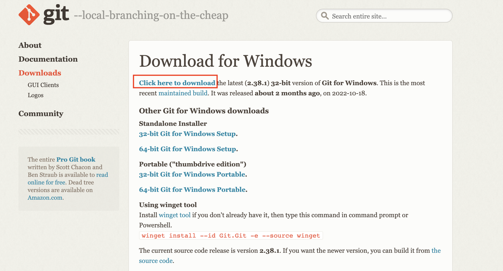
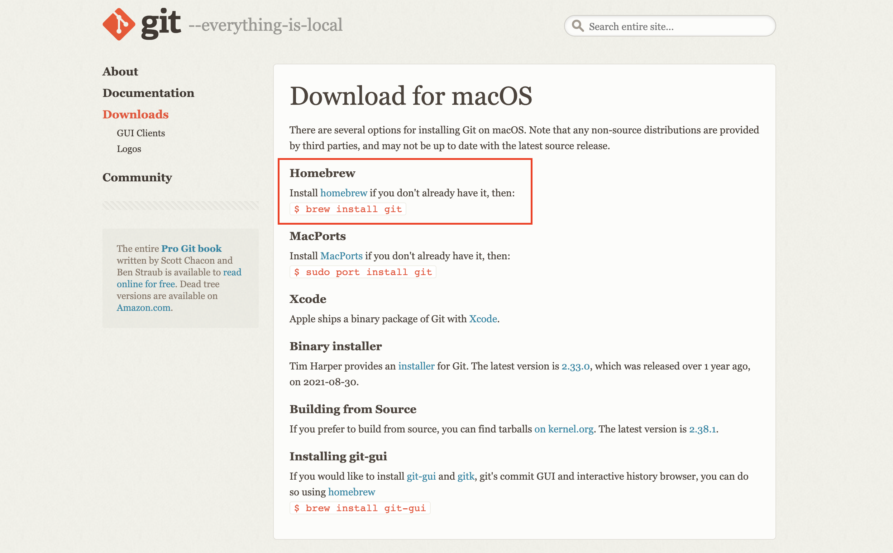

# Git Tutorial for MLOps

## Installing Git for Microsoft Windows

To install Git, go to the official Git website downloads page for Microsoft Windows [https://git-scm.com/download/win](https://git-scm.com/download/win). This page presents several ways you can download Git.

For the Learning Git book, we recommend you use the first and main download option to install Git which provides an installer. To do so, select the **Click here to download** link. This will download an installer that you will use to go through the step-by step installation process. You should accept all the default settings as you go through the installer.



By using this download option to install Git, you will also have a version of Git installed which is definitely greater than 2.23 which is the minimum version we recommend in order to have access to all the commands in this book.

The installer will go through step-by step instructions to take you through the installation process. You should accept all the default settings as you go through the installer. In Follow Along #-#, we present the 13 steps the installer will go through and instruct you to select the default options.

|     | Follow Along #-#                                                                                                                 |
| --- | :------------------------------------------------------------------------------------------------------------------------------- |
| 1   | On the **Select Destination Location** screen, accept the default location and select **Next**.                                  |
| 2   | On the **Select Components** screen, accept the default location and select **Next**.                                            |
| 3   | On the **Select Start Menu Folder** screen, accept the default location and select **Next**.                                     |
| 4   | On the **Choosing the default editor used by Git** screen, accept the default location and select **Next**.                      |
| 5   | On the **Adjusting the name of the initial branch in new repositories** screen, accept the default location and select **Next**. |
| 6   | On the **Adjusting your PATH environment** screen, accept the default location and select **Next**.                              |
| 7   | On the **Configuring the line ending conversions** screen, accept the default and select **Next**.                               |
| 8   | On the **Configuring the terminal emulator to use with Git Bash** screen, accept the default and select **Next**.                |
| 9   | On the **Choose the default behavior of `git pull`** screen, accept the default and select **Next**.                             |
| 10  | On the **Choose a credential helper** screen, accept the default and select **Next**.                                            |
| 11  | On the **Configuring extra options** screen, accept the default and select **Next**.                                             |
| 12  | On the **Configuring experimental options** screen, accept the default and select **Next**.                                      |
| 13  | On the **Completing the Git Setup Wizard** screen, select **Finish**.                                                            |

Now that you have finished going through the steps of the installer you should have Git installed on your computer. To check whether Git successfully installed, you should open a Git Bash command line window and use the git version command to check what version of Git you have installed on your computer. Let’s do this in Follow Along #-#.

|     | Follow Along #-#                                                                 |
| --- | :------------------------------------------------------------------------------- |
| 1   | Search for the Git Bash command line application and open a command line window. |
| 2   | \$ **`git version`**<br>`git version 2.38.1.windows.1`                           |

What to notice:

- The output of the `git version` command shows you what version of Git you have installed on your computer.

You have completed Git installation.

## Installing Git for macOS


To install Git, go to the official Git website downloads page for macOS [https://git-scm.com/download/mac](https://git-scm.com/download/mac). This page presents several ways you can download Git.



By using Homebrew to install Git, you will also have a version of Git installed which is definitely greater than 2.23 which is the minimum version we recommend in order to have access to all the commands in this book.

To install Git using Homebrew, you must have Homebrew installed. If you don’t have Homebrew installed then go to Follow Along #-#.

|     | Follow Along #-#                                                                                                                                                                                             |
| --- | :----------------------------------------------------------------------------------------------------------------------------------------------------------------------------------------------------------- |
| 1   | Go to the Homebrew website [https://brew.sh/](https://brew.sh/) and copy the command to install Homebrew.                                                                                                    |
| 2   | Open a command line window and paste the command to install Homebrew where the cursor is. The directory location in the command line is not important when you execute this command in step 3.               |
| 3   | \$ <strong>`/bin/bash -c "$(curl -fsSL https://raw.githubusercontent.com/Homebrew/install/HEAD/install.sh)"`</strong><br>`===> Checking for sudo access (which may request your password)...`<br>`Password:` |
| 4   | When the command prompts you to enter a password, enter the password for your user on your computer.                                                                                                         |
| 5   | To complete the installation press Enter.                                                                                                                                                                    |
| 6   | \$ **`brew --version`**<br>`Homebrew 3.6.7`<br>`Homebrew/homebrew-core (git revision 4917c76d4d2; last commit 2022-10-29)`                                                                                   |

What to notice:

- In step 6, the output should show what version of Homebrew you have installed.

Now that Homebrew is installed, the next step is to install Git. In order to do that, you will use the `brew install git` command. And afterwards, you will use the `git version` command to check what version of Git you installed on your computer. Let’s carry all of this out in Follow Along #-#.

|     | Follow Along #-#                             |
| --- | :------------------------------------------- |
| 1   | \$ **`brew install git`**                    |
| 2   | \$ **`git version`**<br>`git version 2.38.1` |

You have completed Git installation.

## Set up authentication credentials to connect over HTTPS

## Create a personal access token in GitHub


In Chapter 6 of Learning Git, you are instructed to choose a hosting service and set up authentication details to connect to remote repositories over the HTTPS or SSH protocols. If you choose to use the HTTPS protocol and you are using GitHub, you must create a personal access token.

The instructions for how to create a personal access token in GitHub are available at: [GitHub Docs - Creating a personal access token](https://docs.github.com/en/authentication/keeping-your-account-and-data-secure/creating-a-personal-access-token).

When creating the personal access token in GitHub, keep in mind the below notes:

- The Note field represents the name for the personal access token
- When selecting an expiration time, we recommend choosing at minimum a time period within which you can finish reading and doing the exercises in the entire book. Otherwise, your personal access token may expire while you're going through the book and you will have to go through the process to create a new one to complete the exercise in the book.
- The scope defines what this token will have access to do or authenticate. For the purpose of this book, you must select at least the repo scope.
- Save the personal access token in a safe place.

> Note: Once you create the authentication credential, for security reasons, you will only see it once. Therefore, you must save it in a secure place. Afterwards, you will only be able to see some details about it, but not the authentication credential itself.


## Create a remote repository


GitHub

- [GitHub Docs - Create a repo](https://docs.github.com/en/get-started/quickstart/create-a-repo)


## Create a pull request (merge request)

GitHub

- [GitHub Docs - Creating a pull request](https://docs.github.com/en/pull-requests/collaborating-with-pull-requests/proposing-changes-to-your-work-with-pull-requests/creating-a-pull-request)

Additional notes: You may skip the overview content and go directly to the numbered list of setps in the [Creating the pull request](https://docs.github.com/en/pull-requests/collaborating-with-pull-requests/proposing-changes-to-your-work-with-pull-requests/creating-a-pull-request?tool=webui#creating-the-pull-request) section.

# Install VS Code

https://code.visualstudio.com/download

# Important Commands

## Git Configurations

Git configurations are settings that allow you to customize how Git works. They consist of variables and their values, and they are stored in a couple of different files. To work with Git, you must set a few configuration variables related to user settings.

```
git version
git config --global --list
git config --global user.name "nachiketh"
git config --global user.email "support@manifoldailearning.in"
git config --global init.defaultBranch main
git config --global --list

```

## Working with Local Repo

```
git init
git status
git add file1.py
git status
git commit -m "myfirst commit"
git status
git log
```
## Working with Branches

```
git branch
git branch dev
git log
git branch
```

## Switching the Branches

```
git switch dev
git checkout dev
# updated the source code
git add . 
git commit -m "v3"
git log
git checkout main
```

## Fast Forward merging
```
#create v4 in dev & commit to the repo
git switch main
git merge dev
```

## Git Checkouts

```
git checkout <commit-hash>
git checkout -b feature
git switch -c featurev2
```

## Remote Git Repositories

```
#create remote repo
git remote add origin <url>
git remote
git remote -v
git push origin main
git branch --all
```

## Cloning and Delete Branches
```
git clone <url> <dir-name>
git clone https://github.com/manifoldailearning/git4mlops.git my-folder
cd my-folder
git branch --all
git checkout -b unit-test
git push -u origin unit-test
git checkout main
git branch -d <branch-name> #delete local branch
git branch -d unit-test
git push origin -d unit-test
git branch --all
```